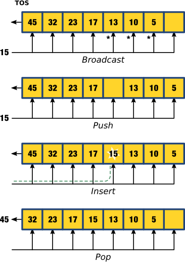

# README

This repository stores a
[Jupyter notebook](hardware_sorters.ipynb "Hardware Sorters Jupyter Notebook") describing and comparing two hardware-based circuits that will sort a list of numbers into descending order.

With the notebook, you can::

* Simulate the operation of these sorter circuits,
* Change the bit-width of the sorted numbers and the size of the sorted lists,
* Output Verilog and VHDL code for implementing the sorters on an FPGA.

To use the notebook, you'll need a Python interpreter (like [Anaconda](https://www.continuum.io/downloads "Anaconda download")),
[Jupyter](http://jupyter.org/ "Jupyter Notebook Project") and
[MyHDL](http://www.myhdl.org/ "MyHDL Project").